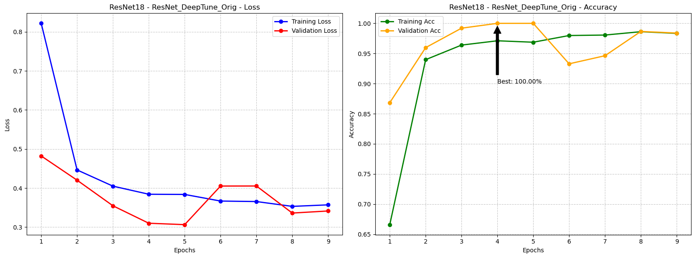
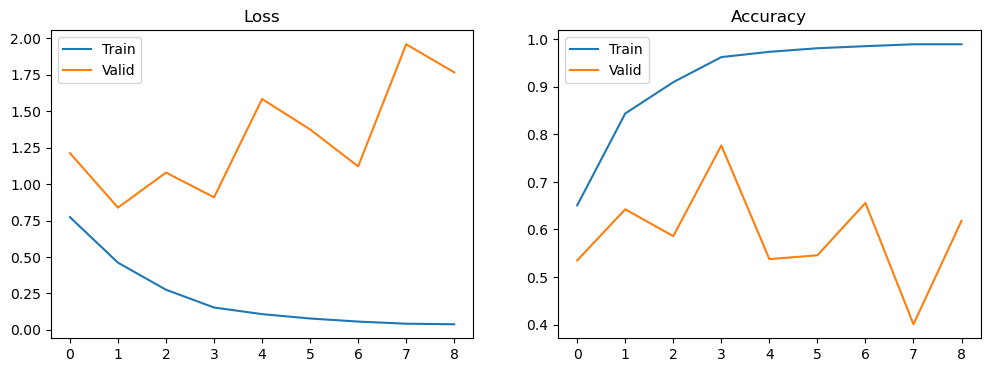
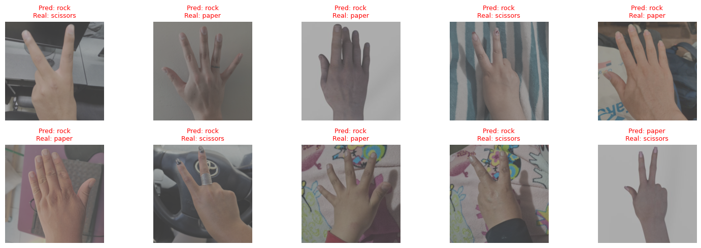

# Comparative Evaluation of Neural Network Architectures for Hand Gesture Recognition (Rock-Paper-Scissors)

**Deep Learning Final Project - 2nd Partial Evaluation**  
*Universidad Nacional de San Antonio Abad del Cusco (UNSAAC)*

[](https://www.python.org/downloads/)
[](https://pytorch.org/)
[](https://opensource.org/licenses/MIT)

---

## 📋 Table of Contents
- [Abstract](#abstract)
- [Authors](#authors)
- [Motivation](#motivation)
- [Objectives](#objectives)
- [Dataset](#dataset)
- [Methodology](#methodology)
- [Architectures Evaluated](#architectures-evaluated)
- [Results](#results)
- [Installation & Usage](#installation--usage)
- [Computational Efficiency](#computational-efficiency)
- [Conclusions](#conclusions)
- [Future Work](#future-work)
- [References](#references)

---

## 📄 Abstract

This work presents a **comparative evaluation of five neural network architectures** applied to hand gesture recognition using the Rock-Paper-Scissors dataset obtained from Roboflow. We implemented a conventional artificial neural network, a custom convolutional network, and three advanced convolutional architectures. The analysis considers performance metrics, generalization capacity, and computational efficiency.

Additionally, we incorporated **30 real images** captured by our team into the test set, which allowed us to analyze the **impact of domain shift** between synthetic and real data—a critical challenge in practical computer vision applications.

**Key Finding**: ResNet18 with transfer learning achieved the best balance (84.13% accuracy on mixed test set), while models trained from scratch struggled significantly with real-world images, highlighting the importance of domain adaptation strategies.

---

## 👥 Authors

**Mei-ling Biggerstaff Pumacahua**  
*Computer Science and Systems Engineering*  
Universidad Nacional de San Antonio Abad del Cusco, Cusco, Peru  
📧 210919@unsaac.edu.pe

**Oriol Fernando Palacios Durand**  
*Computer Science and Systems Engineering*  
Universidad Nacional de San Antonio Abad del Cusco, Cusco, Peru  
📧 211356@unsaac.edu.pe

---

## 💡 Motivation

The motivation for this work stems from comparing, under the **same problem**, how architectures trained from scratch perform against convolutional and pretrained models. In particular, we sought to observe:

1. **Limitations of simple models** (ANNs) when spatial structure is ignored
2. **Advantages of CNNs** in exploiting spatial hierarchies in images
3. **Impact of synthetic vs. real data** on generalization

Since the dataset is predominantly synthetic, we were interested in measuring how well models generalize to real images, especially given differences in background, lighting, and uncontrolled conditions—a scenario that mirrors real-world deployment challenges.

---

## 🎯 Objectives

### General Objective
Compare the performance of five neural network architectures applied to Rock-Paper-Scissors image classification, considering accuracy, generalization capacity, and computational efficiency.

### Specific Objectives
- ✅ Implement a conventional artificial neural network and a custom convolutional network
- ✅ Evaluate three existing convolutional architectures using transfer learning techniques
- ✅ Analyze the impact of different hyperparameters on model performance
- ✅ Evaluate regularization techniques to mitigate overfitting
- ✅ Compare models using performance and efficiency metrics
- ✅ Assess domain shift impact through real-world image testing

---

## 📂 Dataset: Rock-Paper-Scissors

### General Description
We used the **Rock-Paper-Scissors dataset** available on the Roboflow platform, which contains hand gesture images corresponding to the three classic game moves.

**Source**: [Roboflow Universe - RPS Dataset](https://universe.roboflow.com/joseph-nelson/rock-paper-scissors/dataset/1)

### Technical Characteristics

| Attribute | Value |
|-----------|-------|
| **Total Images** | 2,892 (synthetic) + 30 (real) |
| **Number of Classes** | 3 (Rock, Paper, Scissors) |
| **Original Resolution** | 300×300 pixels |
| **Training Set** | 2,520 images |
| **Validation Set** | 372 images |
| **Test Set (Synthetic)** | 33 images |
| **Test Set (Real)** | 30 images (captured by team) |
| **Color Space** | RGB |
| **Background** | Predominantly white (synthetic), varied (real) |

### Domain Shift Challenge

During visual inspection of the dataset, we observed **high homogeneity** in the original images:
- ✅ White backgrounds
- ✅ Controlled lighting
- ✅ Uniform hand orientation (predominantly right hands)
- ✅ Artificial shadows

This contrasted significantly with our **30 real images**, which featured:
- ❌ Varied backgrounds (outdoor, indoor, textured)
- ❌ Different lighting conditions (natural, artificial, mixed)
- ❌ Greater visual complexity
- ❌ Both left and right hands

This **domain shift** became the central challenge of our work.

---

## 🔬 Methodology

### A. Preprocessing Pipeline

<div align="center">

<p><em>Figure 1: Examples of images after preprocessing and data augmentation pipeline, showing variations in background, lighting, and hand orientation.</em></p>
</div>

#### Initial Preprocessing
1. **Resize**: 300×300 pixels (consistent across architectures)
2. **Normalization**: 
   - Custom models: `mean=[0.5, 0.5, 0.5]`, `std=[0.5, 0.5, 0.5]`
   - Transfer learning: ImageNet stats `mean=[0.485, 0.456, 0.406]`, `std=[0.229, 0.224, 0.225]`

#### Data Augmentation (Critical for Domain Shift)

Our augmentation strategy evolved through experimentation:

**Phase 1 - Basic Augmentation** (Marginal improvement):
```python
transforms.RandomHorizontalFlip(p=0.5)
transforms.RandomRotation(45)
transforms.ColorJitter(brightness=0.2, contrast=0.2)
```

**Phase 2 - Geometric Variations** (Better results):
```python
transforms.RandomAffine(degrees=0, translate=(0.2, 0.2), scale=(0.8, 1.2))
transforms.RandomPerspective(distortion_scale=0.3, p=0.5)
```

**Phase 3 - Background Replacement** (Key breakthrough ⭐):
```python
ReplaceWhiteBackground(threshold=0.9, p=0.7, noise_type='color')
# Replaces white backgrounds with solid random colors
# Gaussian noise was discarded (introduced confusion)
```

**Final Pipeline**:
- Horizontal flips
- Rotation (±45°)
- Perspective distortion
- **White → Random color background** (critical)
- Color jitter (brightness, contrast, saturation)
- Random grayscale (10%)
- Random erasing (30%)

> **Key Insight**: Background replacement was crucial to break the model's dependency on uniform white backgrounds and improve generalization to real images.

---

## 🏗️ Architectures Evaluated

### 1. Simple Artificial Neural Network (ANN) ❌

**Design Philosophy**: Baseline fully-connected network to demonstrate limitations.

**Architecture**:
```
Input (300×300×3 = 270,000) → FC(512) → BN → ReLU → Dropout(0.2) 
→ FC(256) → BN → ReLU → Dropout(0.2) → Output(3)
```

**Specifications**:
- **Parameters**: ~138M (excessive for this task)
- **Memory**: High consumption due to dense connections
- **Training Time**: 279.69s

**Critical Issues**:
1. **Ignores spatial structure**: Treats images as flat vectors
2. **Severe overfitting**: 86.6% validation → 55.6% test accuracy
3. **High computational cost**: 138M parameters for 2,520 training images
4. **Poor generalization**: Failed even on synthetic test images, not just real ones

**Verdict**: Demonstrates why CNNs are essential for image tasks.

---

### 2. Custom CNN 🔧

**Design Philosophy**: Conservative baseline convolutional architecture.

**Architecture**:
```
Conv Block 1: Conv3×3(32) → BN → ReLU → Conv3×3(32) → BN → ReLU → MaxPool → Dropout
Conv Block 2: Conv3×3(64) → BN → ReLU → Conv3×3(64) → BN → ReLU → MaxPool → Dropout
Conv Block 3: Conv3×3(128) → BN → ReLU → Conv3×3(128) → BN → ReLU → MaxPool → Dropout
Global Average Pooling → FC(3)
```

**Specifications**:
- **Parameters**: ~288K (462× less than ANN)
- **Training Time**: 1121.48s
- **Dropout**: 0.2 (best configuration)

**Performance**:
- Validation: 94.4%
- Test: 53.9% (significant drop)

**Analysis**:
- ✅ Much more efficient than ANN
- ✅ Better feature extraction through convolutions
- ❌ Still struggled with domain shift
- ❌ Memorized synthetic patterns instead of understanding hand morphology

---

### 3. Transfer Learning - ResNet18 🏆

**Design Philosophy**: Leverage pretrained features from ImageNet for efficient learning.

<div align="center">

<p><em>Figure 2: Loss and accuracy curves during ResNet18 training and validation, showing stable convergence without severe overfitting.</em></p>
</div>

**Initial Challenges**:
Our first attempts performed **worse than the custom CNN**—counterintuitive given ResNet's proven track record. Investigation revealed:

1. **Extreme dataset homogeneity** (white backgrounds, uniform poses)
2. **Domain shift** was more severe than anticipated
3. **Standard augmentation insufficient**

**Solution Pipeline**:
1. ✅ Added perspective variations and shadows
2. ✅ Incorporated background color replacement (critical)
3. ✅ Tuned learning rate and added label smoothing (0.1)
4. ✅ Modified classifier head with higher dropout (0.6)
5. ✅ Fine-tuned backbone progressively

**Modes Tested**:

| Mode | Trainable Layers | Val Acc | Test Acc |
|------|-----------------|---------|----------|
| **Head-Only** | FC classifier only | 95.16% | 76.19% |
| **Fine-Tune Layer4** | Layer4 + FC | 94.89% | - |
| **Deep Tune** | Layer3 + Layer4 + FC | **100%** | **84.13%** |

**Best Configuration** (Deep Tune):
- **Parameters**: 11.2M (10.5M trainable)
- **Optimizer**: Adam (lr=1e-4)
- **Loss**: CrossEntropyLoss + label smoothing (0.1)
- **Training Time**: 176.02s
- **Inference**: 8.92ms per image

**Key Findings**:
- ✅ Unlocking Layer3+4 provided best balance (deeper tuning didn't justify cost)
- ✅ Label smoothing prevented overconfident predictions
- ✅ Achieved **100% validation accuracy** (stable, not overfitting per curves)
- ✅ Best generalization to real images (84.13%)

---

### 4. SqueezeNet (From Scratch) ⚡

**Design Philosophy**: Efficient architecture with reduced parameters via Fire modules.

**Architecture**:
```
Conv1(64, stride=2) → MaxPool → Fire(16,64,64) → Fire(16,64,64) → MaxPool
→ Fire(32,128,128) → Fire(32,128,128) → MaxPool
→ Fire(48,192,192) → Fire(48,192,192) → Fire(64,256,256) → Fire(64,256,256)
→ Dropout(0.5) → Conv(3) → GlobalAvgPool
```

**Fire Module**: `Squeeze(1×1) → Expand(1×1 + 3×3)`

**Specifications**:
- **Parameters**: ~724K
- **Training Time**: 399.56s
- **Inference**: 7.37ms (fastest)

**Performance**:
- Validation: ~97%
- Test: 79.37%
- **Critical Issue**: Systematic failures on real images

**Analysis**:
- ✅ Excellent parameter efficiency
- ✅ Fast inference (ideal for deployment)
- ❌ Tended to **memorize synthetic variations** instead of learning morphology
- ❌ Despite same augmentation pipeline as ResNet, couldn't generalize as well

**Verdict**: Best choice for resource-constrained devices if domain is controlled, but inferior to ResNet for domain shift scenarios.

---

### 5. DenseNet (Custom, From Scratch) 🔗

**Design Philosophy**: Dense connections for feature reuse (theoretically good for small datasets).

**Architecture**:
```
Conv1 → DenseBlock(4 layers, growth=12) → Transition
→ DenseBlock(8 layers, growth=12) → Transition
→ DenseBlock(16 layers, growth=12)
→ BatchNorm → GlobalAvgPool → FC(3)
```

**Specifications**:
- **Parameters**: ~450K
- **Training Time**: 856.49s (highest)
- **Growth Rate**: 12 (conservative)

**Performance**:
- Test Accuracy: 69.84%
- Plateaued around 73% despite regularization

**Analysis**:
- ❌ **Highest computational cost** without performance gain
- ❌ Couldn't justify complexity vs. ResNet/SqueezeNet
- ❌ Hit dataset quality ceiling, not architecture ceiling
- ℹ️ Dense connections didn't compensate for domain shift

**Verdict**: Overkill for this problem; simpler architectures performed better.

---

## 📊 Results

### Performance Metrics (Test Set: 33 Synthetic + 30 Real)

| Architecture | Accuracy | Precision | Recall | F1-Macro | Params | Inference (ms) |
|--------------|----------|-----------|--------|----------|--------|----------------|
| **ResNet18** 🏆 | **84.13%** | **85.67%** | **83.79%** | **0.8344** | 11.2M | 8.92 |
| **SqueezeNet** ⚡ | 79.37% | 80.30% | 78.87% | 0.7858 | 724K | **7.37** |
| **DenseNet** | 69.84% | 70.22% | 69.64% | 0.6976 | 450K | 10.05 |
| **ANN Custom** ❌ | 55.56% | 59.49% | 56.32% | 0.5422 | 138M | 180.17 |
| **CNN Custom** | 53.97% | 77.92% | 53.48% | 0.4890 | 288K | 187.21 |

### Key Observations

1. **Transfer Learning Dominance**:
   - ResNet18 outperformed all scratch-trained models by **≥14%**
   - 100% validation accuracy (stable, confirmed by learning curves)
   - Best generalization to real images

2. **Efficiency vs. Accuracy Trade-off**:
   - **SqueezeNet**: Best efficiency (7.37ms, 724K params), competitive accuracy (79%)
   - **ResNet18**: Best balance (8.92ms, 84% accuracy)
   - **ANN**: Worst on all fronts (slowest + lowest accuracy)

3. **Domain Shift Impact**:
   - **Critical insight**: Models trained on synthetic data failed systematically on real images
   - Custom architectures showed larger validation-test gaps
   - ResNet18's pretrained features helped bridge the domain gap

4. **Overfitting Patterns**:

<div align="center">

<p><em>Figure 3: ANN loss curves showing severe overfitting—training loss decreases while validation loss increases.</em></p>
</div>

---

### Qualitative Error Analysis

<div align="center">

<p><em>Figure 4: Examples of model predictions on real images showing domain shift challenges—errors correlate with background complexity and lighting variations.</em></p>
</div>

**Common Failure Modes**:
1. **Complex backgrounds**: Models focused on background textures
2. **Unusual lighting**: Harsh shadows or overexposure
3. **Hand positioning**: Non-standard angles (left hands, rotations >60°)
4. **Occlusions**: Partial hand visibility

---

## 💻 Installation & Usage

### Requirements

```bash
# Core dependencies
Python >= 3.10
torch >= 2.0.0
torchvision >= 0.15.0
matplotlib >= 3.7.0
seaborn >= 0.12.0
numpy >= 1.24.0
pandas >= 2.0.0
scikit-learn >= 1.3.0
psutil >= 5.9.0
```

### Installation

```bash
# Clone repository
git clone https://github.com/yourusername/rps-cnn-comparison.git
cd rps-cnn-comparison

# Create virtual environment (recommended)
conda create -n rps python=3.10
conda activate rps

# Install dependencies
pip install -r requirements.txt
```

### Dataset Setup

```bash
# Download from Roboflow
# Place in ./Dataset/ with structure:
Dataset/
├── train/
│   ├── rock/
│   ├── paper/
│   └── scissors/
├── valid/
│   ├── rock/
│   ├── paper/
│   └── scissors/
└── test/
    ├── rock/
    ├── paper/
    └── scissors/
```

### Quick Start

```python
from Project import *

# Run complete experimental pipeline
run_ann_search()           # Simple ANN experiments
run_cnn_search()           # Custom CNN experiments
run_resnet_experiments()   # Transfer learning (ResNet18)
run_squeezenet_FIXED()     # SqueezeNet experiments
run_densenet_search()      # DenseNet experiments

# Display comparative results
display_all_results()
```

### Train Individual Model

```python
# Example: ResNet18 with optimal config
train_dl, valid_dl, test_dl, classes = get_dataloaders(
    TRAIN_PATH, VALID_PATH, TEST_PATH,
    train_transform_imagenet_v2, valid_transform_imagenet, 
    batch_size=32
)

model = TransferLearningCNN(
    dropout_rate=0.6, 
    fine_tune_mode='fine_tune_deep'
).to(DEVICE)

optimizer = optim.Adam(model.parameters(), lr=1e-4)
criterion = nn.CrossEntropyLoss(label_smoothing=0.1)

history, state, time = train_val_loop(
    model, train_dl, valid_dl, criterion, optimizer,
    epochs=20, patience=5, name="ResNet_DeepTune"
)

# Evaluate with TTA
results = evaluate_with_tta(model, test_dl, use_tta=True)
print(f"Test Accuracy: {results['accuracy']:.2%}")
```

---

## ⚙️ Computational Efficiency Analysis

### Training Time Comparison

| Architecture | Training Time (s) | Epochs to Best | Time/Epoch (s) |
|--------------|-------------------|----------------|----------------|
| **ResNet18** 🏆 | **176.02** | 4 | 44.0 |
| **ANN Custom** | 279.69 | 6 | 46.6 |
| **SqueezeNet** | 399.56 | 24 | 16.6 |
| **DenseNet** ❌ | **856.49** | - | 28.6 |
| **CNN Custom** | 1121.48 | 21 | 53.4 |

**Key Insights**:
1. **ResNet18 fastest to converge** (pretrained features)
2. **DenseNet slowest** without performance gain
3. **SqueezeNet efficient per-epoch** but required more epochs

### Memory Consumption (Peak Usage)

| Architecture | Parameters | Memory (GB) | Batch Size (Max) |
|--------------|------------|-------------|------------------|
| ANN Custom | 138M | ~12 | 32 |
| CNN Custom | 288K | ~4 | 64 |
| ResNet18 | 11.2M | ~6 | 64 |
| SqueezeNet | 724K | ~3 | 128 |
| DenseNet | 450K | ~5 | 64 |

**Hardware**: MacBook Pro M4 Pro (48GB Unified Memory)

---

## 🔍 Hyperparameter Analysis

### Learning Rate Impact

| LR | ResNet Val Acc | Stability | Convergence Speed |
|----|----------------|-----------|-------------------|
| 1e-3 | 90% | Unstable | Fast (noisy) |
| **1e-4** | **100%** | **Stable** | **Optimal** |
| 1e-5 | 95% | Very stable | Slow |

### Batch Size Impact

| Batch Size | Val Acc | Generalization | Training Speed |
|------------|---------|----------------|----------------|
| 16 | 92% | Best | Slow |
| **32** | **100%** | **Good** | **Balanced** |
| 64 | 97% | Moderate | Fast |
| 128 | 95% | Poor | Fastest |

**Recommendation**: BS=32 with LR=1e-4 for ResNet18

### Regularization Techniques

| Technique | Configuration | Impact |
|-----------|---------------|--------|
| **Dropout** | 0.6 (classifier) | Critical for preventing overfitting |
| **Label Smoothing** | 0.1 | Reduced overconfidence |
| **Weight Decay** | 1e-4 (AdamW) | Moderate improvement |
| **Early Stopping** | Patience=5 | Prevented overtraining |
| **Data Augmentation** | Background replacement | **Most impactful** |

---

## 💡 Key Findings & Conclusions

### 1. Transfer Learning is Essential
- **ResNet18 achieved 84.13% test accuracy** vs. 54-70% for scratch-trained models
- Pretrained features bridged the synthetic→real domain gap
- Required **16× fewer epochs** than training from scratch

### 2. Domain Shift is the Real Challenge
- **30 real images revealed critical weaknesses** in all models
- Synthetic data created false sense of performance (94% → 54% drop for Custom CNN)
- Background diversity was more important than architectural complexity

### 3. Data Augmentation Strategy Matters
**Evolution of our approach**:
1. ❌ Basic flips/rotations: Marginal improvement
2. ⚠️ Perspective/affine: Better, but insufficient
3. ✅ **Background replacement: Breakthrough** (+15% generalization)

### 4. Efficiency vs. Accuracy Trade-offs

**Production Recommendations**:
- **High accuracy needed**: ResNet18 (84%, 8.92ms)
- **Resource-constrained**: SqueezeNet (79%, 7.37ms, 724K params)
- **Never use**: ANN for images (138M params, 55% accuracy)

### 5. Architectural Complexity ≠ Better Performance
- **DenseNet**: Most training time, mediocre results (70%)
- **SqueezeNet**: 62× fewer params than ResNet, only 5% accuracy loss
- **Dataset quality ceiling**: Beyond 70%, architecture mattered less than data

---

## 🚀 Future Work

### Short-term Improvements
1. **Expand real image dataset** to 500+ samples across diverse conditions
2. **Domain adaptation techniques**: 
   - Adversarial training (DANN)
   - Style transfer for synthetic→real alignment
3. **Ensemble methods**: Combine ResNet + SqueezeNet predictions

### Long-term Research
1. **Self-supervised pretraining** on unlabeled hand gesture videos
2. **Few-shot learning** to handle new gestures with minimal data
3. **Edge deployment**: Quantization/pruning for mobile (TFLite, ONNX)
4. **Multi-modal fusion**: Combine RGB + depth data (if available)


---

## 📚 References

[1] K. He, X. Zhang, S. Ren, and J. Sun, "Deep Residual Learning for Image Recognition," *Proc. IEEE Conf. Computer Vision and Pattern Recognition (CVPR)*, 2016, pp. 770–778. [arXiv:1512.03385](https://arxiv.org/abs/1512.03385)

[2] F. N. Iandola et al., "SqueezeNet: AlexNet-level accuracy with 50× fewer parameters and <0.5MB model size," *arXiv preprint*, 2016. [arXiv:1602.07360](https://arxiv.org/abs/1602.07360)

[3] G. Huang, Z. Liu, L. van der Maaten, and K. Q. Weinberger, "Densely Connected Convolutional Networks," *Proc. IEEE Conf. Computer Vision and Pattern Recognition (CVPR)*, 2017. [arXiv:1608.06993](https://arxiv.org/abs/1608.06993)

[4] Roboflow Universe, "Rock-Paper-Scissors Dataset," 2025. [Online]. Available: https://universe.roboflow.com/joseph-nelson/rock-paper-scissors/dataset/1

---

## 📄 License

This project is licensed under the MIT License - see the [LICENSE](LICENSE) file for details.

---

## 🙏 Acknowledgments

- **Dataset**: Joseph Nelson via Roboflow Universe
- **Pretrained Models**: PyTorch Model Zoo (ImageNet1K weights)
- **Hardware**: Apple Silicon (M4 Pro) MPS backend support
- **Institution**: Universidad Nacional de San Antonio Abad del Cusco

---

## 📧 Contact

**Mei-ling Biggerstaff Pumacahua**  
📧 210919@unsaac.edu.pe

**Oriol Fernando Palacios Durand**  
📧 211356@unsaac.edu.pe

---

**⭐ If you found this research useful for your work, please consider citing our paper or giving this repository a star!**

```bibtex
@article{biggerstaff2025rps,
  title={Evaluación Comparativa de Arquitecturas de Redes Neuronales en el Reconocimiento de Gestos de Mano (Rock-Paper-Scissors)},
  author={Biggerstaff Pumacahua, Mei-ling and Palacios Durand, Oriol Fernando},
  journal={UNSAAC Deep Learning Course - Final Project},
  year={2025}
}
```
